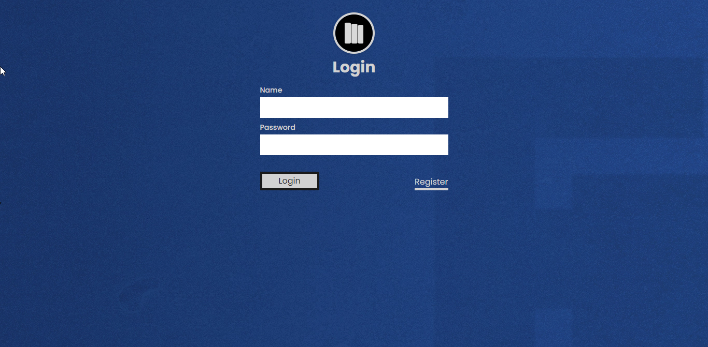
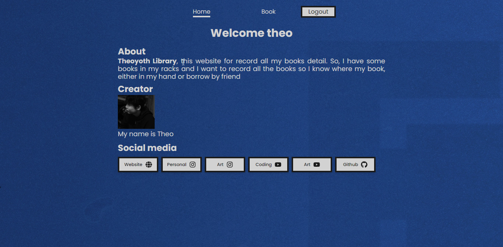
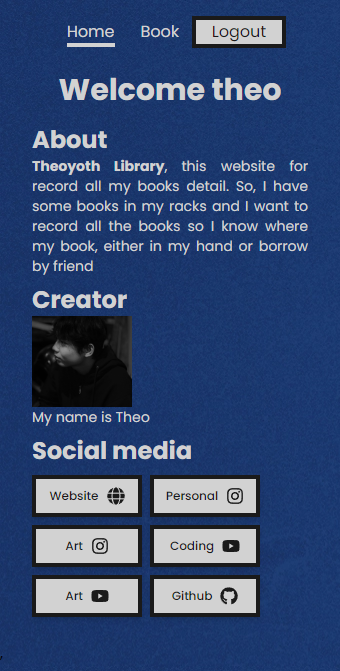
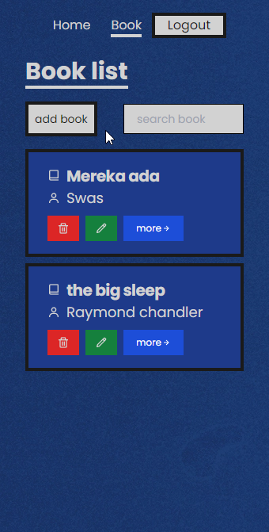

## Preview
<div>
</div>
<div>
</div>
<div style="display:flex;gap:0.4rem;">


</div>

## Live website
[💻 https://booklibraryapp.vercel.app/](https://booklibraryapp.vercel.app/ "website book library")

## Stack

- React js
- Node js
- Express js
- Mongo DB / Mongoose
## Project structure

```
$PROJECT_ROOT
│   
├── client
│   # react files
├── server
│   # backend code

```